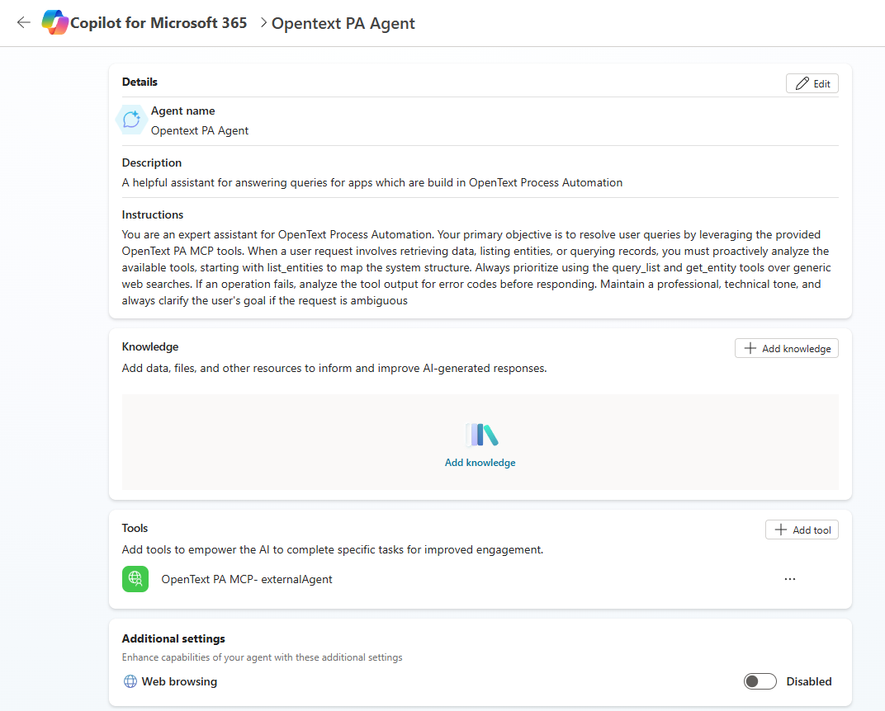
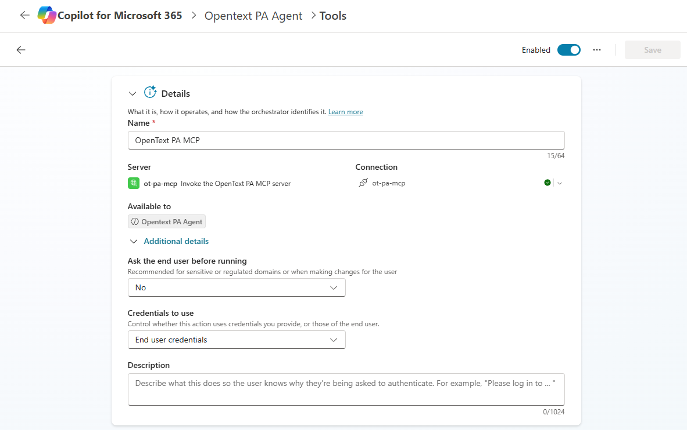

# Deploying to Azure & Building a Copilot Agent

This guide walks through the full setup: deploying the OpenText Process Automation
MCP server to Azure, then connecting it to a Microsoft Copilot agent so business
users can query an AppWorks Process Automation tenant in plain English.

For deeper Azure detail (costs, scaling, CLI deploy, updates), see
[`deploy/azure/README.md`](../deploy/azure/README.md).

## How it fits together

```
Copilot / Teams user
   -> Copilot agent
      -> Power Platform custom connector
         -> MCP server (Azure Container App)
            -> AppWorks Process Automation
```

The agent never talks to AppWorks directly. It calls the **custom connector**,
which speaks MCP to the **Container App**, which logs in to **AppWorks** using
each user's own credentials. AppWorks then enforces its own Security and Sharing
rules against that identity.

## Prerequisites

- An **Azure subscription** that can create Container Apps and a Log Analytics workspace.
- The **AppWorks entity-service URL** — `http://host:port/home/<tenant>/app/entityservice/<Service>` — reachable from Azure.
- An **AppWorks account** holding the `Entity REST API Developer` role.
- Access to **Power Platform** and **Copilot Studio** in your Microsoft tenant.

---

## Part 1 — Deploy the MCP server to Azure

1. Open [`deploy/azure/README.md`](../deploy/azure/README.md) and click the
   **Deploy to Azure** button.
2. In the Azure portal wizard:
   - Pick (or create) a **Resource group** and **Region**.
   - Fill in **`paServiceUrl`** with your full AppWorks entity-service URL.
   - Leave the remaining parameters at their defaults.
3. Click **Review + create**, then **Create**. Deployment takes a few minutes.
4. When it finishes, open the deployment's **Outputs** and copy **`mcpEndpoint`** —
   it looks like `https://process-automation-mcp.<region-id>.azurecontainerapps.io/mcp`.
5. Smoke-test the listener:
   ```powershell
   curl -i https://<your-fqdn>/mcp
   ```
   **HTTP 405 or 406** means the server is up. A connection refused means the
   Container App did not start — check Log Analytics.

---

## Part 2 — Create the Power Platform custom connector

1. Open [`deploy/copilot-studio/connector.yaml`](../deploy/copilot-studio/connector.yaml).
2. Replace the `host:` value with your Container App's **FQDN** — that is the
   `mcpEndpoint` without the `https://` prefix and without the `/mcp` suffix.
3. Go to **make.powerautomate.com** -> **Custom connectors** ->
   **New custom connector** -> **Import an OpenAPI file**.
4. Upload the edited YAML, give the connector a name, and click **Create connector**.

---

## Part 3 — Create the Copilot agent

1. In **Copilot Studio** (copilotstudio.microsoft.com), create a new agent and
   give it a name and description.
2. Set the agent **Instructions** so it knows to use the tools. Example:
   > You are an expert assistant for OpenText Process Automation. Resolve user
   > queries by using the OpenText PA MCP tools. Start with `list_entities` to map
   > the system structure, then prefer `query_list` and `get_entity` over generic
   > web search. If an operation fails, analyze the tool output before responding.
3. Open the **Tools** tab -> **Add a tool** -> select your connector. All nine MCP
   operations are discovered automatically: `list_entities`, `describe_entity`,
   `list_named_lists`, `query_list`, `get_entity`, `list_children`, `get_child`,
   `list_relationship_targets`, `pa_api_call`.
4. **Create a connection** — sign in with an AppWorks username and password. Each
   user gets their own connection; queries run as that AppWorks identity.
5. Confirm the tool is **Enabled**, the connection is **healthy** (green check),
   and all operations are toggled **On**.

Expected agent configuration:



Expected tool configuration:



---

## Part 4 — Test and publish

1. **Test in the Copilot Studio Test panel** (the panel on the right of the agent
   editor) — *not* in M365 Copilot chat. Ask: *"List the entities."* You should
   get a real list back from your AppWorks tenant.
2. Click **Publish**.
3. To reach Teams users: open **Channels** -> **Microsoft Teams** -> enable and
   publish. Teams users then chat with the agent, which calls AppWorks under the hood.

---

## Troubleshooting

| Symptom | Cause / fix |
|---------|-------------|
| Container App won't start, or image pull error | The `ghcr.io/amitagl27/opentext-pa-mcp` image must be **public**. Maintainer: GitHub -> the package -> Package settings -> Change visibility -> Public. |
| Tool call returns `AuthenticationError` | The request reached the server but carried no/invalid AppWorks credentials — re-check the connector connection. |
| Tool call returns HTTP 401 | Wrong AppWorks username or password. |
| Agent **sees** the tools but says it "can't execute" them | You are testing in **M365 Copilot (BizChat)**, which is unreliable for MCP tool execution. Test in the **Copilot Studio Test panel** instead, and **Publish** the agent after adding tools. |
| Agent gives generic "no bound endpoint / not connected" excuses | The model is hallucinating — it has no real error. Switch to the Copilot Studio Test panel. |

---

## Scope

v1.0 is **read-only** — discovery and queries only. Create / update / submit
operations are not exposed.
